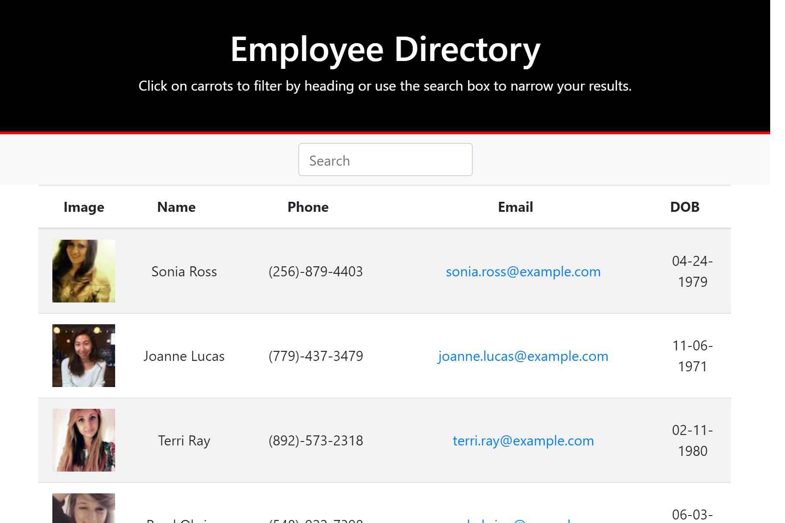
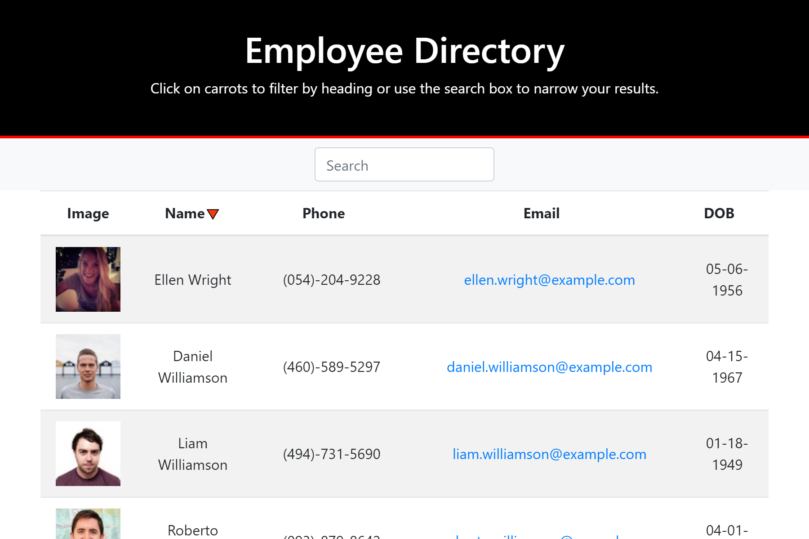

# _EMPLOYEE-DIRECTORY_

## Description

This React application renders an employee list into a table. The source of the employee data https://randomuser.me. The user can search for specific entries or sort via the column headers.

This project was bootstrapped with [Create React App](https://github.com/facebook/create-react-app).

## Libraries

employee-directory was developed using:

- Node.js
- axios
- React
- React-dom
- React-router-dom
- React-scripts

## Installation

Clone the repository, run npm install, then npm start

## Deployment

This app is deployed at https://frunox.github.io/employee-directory/.

From the command line, run 'npm run deploy' to create a build on branch 'gh-pages'.

From the Github repository page, go to Settings>GitHub Pages and set the source to 'gh-pages branch' to properly deploy the application.

## Usage

The app opens on the rendered list of employees:

The list can be sorted by clicking on the column headings Name, Phone, Email and DOB. The Names column is sorted by the last name:

The list is also searchable:

## License

MIT open source license.

 jrcannon@msn.com
